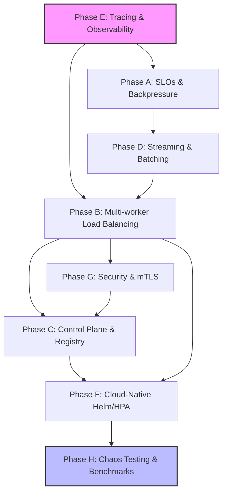

# V-Gate Advanced Architectural Roadmap

This document outlines the advanced engineering phases of V-Gate, focusing on system design, distributed scaling, and production maturity. It is intended for technical interviewers, contributors, and infra-engineers.

---

## Architectural Philosophy: The Bottom-Up Approach

To build a truly resilient AI serving system, we prioritize **Observability and Reliability** as the foundation. We believe you cannot optimize what you cannot measure, and you cannot scale what is not stable.

### Dependency & Evolution Graph

---

## Stage 1: The Foundation (Observe & Control)

### Phase E: Distributed Tracing & Deep Observability
- **The Challenge**: Debugging "Heisenbugs" in asynchronous batching and distributed routing.
- **The Solution**: Full **OpenTelemetry** integration. Every request carries a `trace_id` through Gateway -> Scheduler -> Worker.
- **Technical Signal**: Deep understanding of the **Observability Pillars** and their role in distributed system maintenance.

### Phase A: Reliability, SLOs & Backpressure
- **The Challenge**: Preventing "Cascading Failures" when the GPU is saturated.
- **The Solution**: **Token Bucket** rate limiting and **Adaptive Backpressure**. Implementing explicit load shedding to maintain tail latency (p95).
- **Technical Signal**: Ability to define and enforce **Service Level Objectives (SLOs)**.

---

## Stage 2: The Core (Optimization)

### Phase D: Streaming & Advanced Batching
- **The Challenge**: Minimizing Time-to-First-Token (TTFT) while maximizing throughput.
- **The Solution**: **SSE Streaming** implementation and **Continuous Batching** logic. This allows tokens to be streamed to the user as they are generated, rather than waiting for the full sequence.
- **Technical Signal**: Proficiency in asynchronous data streams and low-level inference pipeline optimization.

---

## Stage 3: The Scaling (Distributed Architecture)

### Phase B: Multi-Worker Scheduling & Load Balancing
- **The Challenge**: Efficiently distributing heterogeneous LLM workloads across multiple GPUs.
- **The Solution**: **Latency-Aware Routing (EWMA)**. Unlike simple Round-Robin, EWMA accounts for the historical performance and current load of each worker.
- **Technical Signal**: Mastery of **Load Balancing Algorithms** and **Circuit Breaker** patterns in a distributed context.

---

## Stage 4: Governance & Compliance

### Phase G: Security & Trust
- **The Challenge**: Securing internal traffic in a multi-tenant environment.
- **The Solution**: **mTLS** for gateway-to-worker communication and comprehensive **Audit Logging** for configuration changes.
- **Technical Signal**: Commitment to the **"Secure by Design"** principle.

### Phase C: Control Plane & Model Registry
- **The Challenge**: Managing multiple model versions and performing zero-downtime rollouts.
- **The Solution**: A centralized **Model Registry** supporting **Canary Rollouts** and live configuration updates.
- **Technical Signal**: Experience in building robust **Control Planes** for cloud-native applications.

---

## Role Tags (CV-Ready Highlights)

### For HR: Competency Labels
- **AI Infra Specialist**: Built a multi-worker LLM gateway with latency-aware routing.
- **Reliability Engineer (SRE)**: Defined SLOs and implemented automated load shedding and circuit breaking.
- **Platform Engineer**: Designed a K8s-native serving platform with custom metrics-based autoscaling.

### For Technical Interviewers: Deep-Dive Topics
- **Distributed Systems**: Implementation of EWMA routing and mTLS-secured RPCs.
- **Concurrency**: High-performance async Python (FastAPI/Trio) and non-blocking I/O.
- **LLM Performance**: Optimizing TTFT via SSE streaming and KV-cache aware scheduling.
- **Observability**: Metric-Trace correlation using OpenTelemetry exemplars.

---

## Design Rationale Analysis

| Decision | Why? | Impact |
| :--- | :--- | :--- |
| **Trace First (E)** | To ensure all subsequent features are debuggable. | Reduces Mean Time to Repair (MTTR). |
| **SLO Before Scale (A)** | To define the boundaries of "stable" before adding workers. | Prevents uncontrolled system collapse under load. |
| **EWMA Over RR (B)** | Simple Round-Robin fails when model inference times vary wildly. | Improves average response time and prevents "hot spotting". |
| **Helm Last (F)** | To avoid constant template churn during active development. | Higher developer velocity. |
