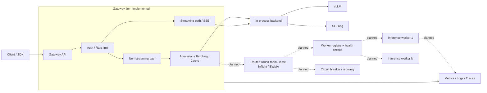

# V-Gate

[](https://github.com/Kare0638/V-Gate/actions/workflows/tests.yml)
[](https://www.apache.org/licenses/LICENSE-2.0)
[](https://www.python.org/downloads/)
[](https://www.docker.com/)

**V-Gate** is an LLM inference gateway being built toward distributed serving: a gateway tier that owns admission, batching, caching, and routing, in front of a pool of inference workers.

The gateway tier is implemented — an OpenAI-shaped Chat Completions subset with streaming, dynamic micro-batching, result caching, observability, security, benchmarking, and container/Kubernetes deployment artifacts. The [vLLM](https://github.com/vllm-project/vllm) path has been exercised against a live GPU; the [SGLang](https://github.com/sgl-project/sglang) path is currently a unit-tested non-streaming adapter and has not yet been validated against a live SGLang engine.

**The worker tier is not implemented yet.** The runtime today is one gateway process holding one in-process backend, not multi-worker serving. Splitting gateway from workers — worker registry, health checks, latency-aware routing, circuit breaking, and 1-vs-N worker evidence — is the current top priority and is tracked as [Phase 4](ROADMAP.md#phase-4-multi-worker-serving). Multimodal requests are a separate planned milestone. Live-GPU validation has been performed on one NVIDIA GeForce RTX 3060 Laptop GPU with 6GB VRAM; no RTX 4060 or multi-GPU validation is claimed.

## Validated Evidence

The evidence below is a measured snapshot of the current serving path. The vLLM run predates parts of the current async path and is retained as a directional baseline pending a refreshed repeat-run report.

| Path | Evidence | Scope |
|------|----------|-------|
| **vLLM live GPU** | [`Qwen/Qwen2.5-1.5B-Instruct-AWQ`](benchmarks/results/vllm_baseline.md) via vLLM 0.26 on an RTX 3060 Laptop GPU: **294.09 generated tokens/s**, **6.47 requests/s**, **1.5264s p95 latency** | 40 requests at concurrency 8, from one small benchmark run; a directional baseline, not a capacity claim |
| **SGLang adapter** | Non-streaming adapter behavior is covered by [`tests/test_backends.py`](tests/test_backends.py) | Unit tests use stubs; no live-engine or live-GPU SGLang benchmark is claimed |

---

## Features

| Feature | Status | Description |
|---------|--------|-------------|
| **OpenAI-Shaped Chat API** | Partial | Chat Completions request/response subset (`/v1/chat/completions`); not claimed as full drop-in OpenAI compatibility |
| **Embeddings Endpoint** | Partial | `/v1/embeddings` currently returns a mock 1536-dimensional vector for API/client testing |
| **Streaming Inference** | Partial | SSE streaming for dry-run and real vLLM; SGLang streaming is not implemented yet |
| **Dynamic Micro-Batching** | Implemented | Aggregate queued non-streaming requests into static gateway batches |
| **Engine-Native Scheduling** | Partial | vLLM uses `AsyncLLMEngine`; the gateway batcher has not yet been redefined as unified admission control |
| **Result Caching** | Implemented | In-memory LRU cache with batch-level deduplication for non-streaming requests |
| **Backend Adapters** | Partial | Select vLLM or SGLang with `model.engine_type`; vLLM is live-GPU validated, while SGLang is currently unit-tested and non-streaming |
| **Built-in Benchmarking** | Implemented | Concurrent load tools, report generation, and `/v1/benchmark` |
| **Observability** | Implemented | Prometheus metrics, structured logs, and optional OpenTelemetry tracing |
| **Security** | Implemented | Bearer API keys and per-key sliding-window rate limits |
| **Configuration as Code** | Implemented | YAML configuration with environment-variable overrides |
| **Container Deployment** | Implemented | Docker CPU/GPU targets, Compose stack, and baseline Kubernetes manifests |
| **Python Client SDK** | Implemented | Sync/async clients with deterministic streaming cleanup |
| **Gateway/Worker Split** | Planned | Move inference out of the gateway process behind a worker API |
| **Worker Registry & Health** | Planned | Worker registration, health checks, and failure isolation |
| **Latency-Aware Routing** | Planned | Round-robin, least-inflight, and EWMA-latency routing strategies |
| **Circuit Breaking & Recovery** | Planned | Trip on unhealthy workers, drain, and rejoin on recovery |

---

## Architecture

Solid arrows are the current runtime; dashed arrows are the planned gateway/worker split. Today everything below runs inside a single process — the backend is called in-process, not over a worker API.



The target boundary: the gateway owns admission control, deduplication, caching, routing, and observability; each worker owns one engine instance and reports health and inflight load. That split is what makes 1-vs-N worker scaling, health-aware failover, and independent GPU-node placement measurable rather than hypothetical.

---

## Documentation

- [Roadmap](ROADMAP.md): detailed roadmap — correctness, continuous batching, reliability, multi-worker routing, Kubernetes, and performance work, with per-phase acceptance criteria. Its `Phase 0-8` numbering is internal to that document; the [Roadmap](#roadmap) section below is the authoritative priority ordering.
- [Documentation conventions](docs/README.md): meaning of the Implemented / Partial / Planned status labels used across these docs.
- [Containerization test report](docs/reports/CONTAINERIZATION_TEST_REPORT.md): Docker validation notes.

---

## Quick Start

### Option 1: Docker (Recommended)

**Real GPU Mode**
```bash
# Build and run with GPU support
docker compose up vgate

# Or build manually
docker build --target vgate-gpu -t vgate:latest .
docker run --gpus all -p 8000:8000 --ipc=host vgate:latest
```

**CPU Mode (CI/Testing)**
```bash
# Run in dry-run mode (no GPU required)
docker compose --profile cpu up vgate-cpu

# Or build manually
docker build --target vgate-cpu -t vgate:cpu .
docker run -p 8000:8000 vgate:cpu
```

**Full Monitoring Stack**
```bash
# Start V-Gate + Prometheus + Grafana
docker compose --profile monitoring up

# Access:
# - V-Gate API:  http://localhost:8000
# - Prometheus:  http://localhost:9090
# - Grafana:     http://localhost:3000 (admin/admin)
```

### Option 2: Local Development

```bash
# Clone repository
git clone https://github.com/Kare0638/V-Gate.git
cd V-Gate

# Create virtual environment
python -m venv .venv
source .venv/bin/activate

# Install dependencies
pip install -r requirements.txt

# Run server
python main.py
```

### Option 3: Isolated SGLang Environment (Recommended)

Use a dedicated virtual environment for `sglang[all]` to avoid dependency conflicts with your existing `vllm` environment.

```bash
cd V-Gate

# Create isolated env for SGLang
uv venv .venv-sglang --python 3.12

# Install base project deps
uv pip install --python .venv-sglang/bin/python -r requirements.txt

# Install SGLang full stack
uv pip install --python .venv-sglang/bin/python "sglang[all]==0.5.9"

# Optional: install test tools in this env
uv pip install --python .venv-sglang/bin/python pytest pytest-asyncio
```

---

## API Usage

### Health Check
```bash
curl http://localhost:8000/health
# {"status":"ok","version":"0.3.2"}
```

### Chat Completions
```bash
curl -X POST http://localhost:8000/v1/chat/completions \
  -H "Content-Type: application/json" \
  -H "Authorization: Bearer sk-vgate-xxxxx" \
  -d '{
    "model": "Qwen/Qwen2.5-1.5B-Instruct-AWQ",
    "messages": [{"role": "user", "content": "What is 2+2?"}],
    "max_tokens": 100
  }'
```

### Streaming Chat Completions

```bash
curl -N -X POST http://localhost:8000/v1/chat/completions \
  -H "Content-Type: application/json" \
  -d '{
    "model": "Qwen/Qwen2.5-1.5B-Instruct-AWQ",
    "messages": [{"role": "user", "content": "What is 2+2?"}],
    "max_tokens": 100,
    "stream": true
  }'
```

Returns OpenAI-style SSE delta chunks. Works for the dry-run backend and real vLLM (`AsyncLLMEngine`, verified on GPU); SGLang still raises a clear error until its async engine streaming path lands (see [ROADMAP.md](ROADMAP.md) Phase 2). The streaming path also bypasses the batcher/cache for now (no dedup or admission control yet).

Streaming has its own `/metrics` series, separate from the batcher's non-streaming TTFT/TPOT since the two are measured differently (engine-reported vs. gateway-side wall clock): `vgate_stream_ttft_seconds`, `vgate_stream_tpot_seconds` (token-weighted — a single SSE delta can carry more than one token), `vgate_stream_duration_seconds`, `vgate_stream_tokens_total`, and `vgate_stream_requests_total{status="completed"|"error"|"cancelled"}`.

### Prometheus Metrics
```bash
curl http://localhost:8000/metrics
```

### Statistics
```bash
curl http://localhost:8000/stats
```

### Inline Benchmark API
```bash
curl -X POST http://localhost:8000/v1/benchmark \
  -H "Content-Type: application/json" \
  -d '{
    "prompts": ["Explain KV cache in one paragraph."],
    "max_tokens": 128,
    "rounds": 3
  }'
```

### Python Client SDK

```bash
pip install ./vgate-client
```

```python
from vgate_client import VGate

# Synchronous client
client = VGate(base_url="http://localhost:8000", api_key="sk-vgate-dev-example")

response = client.chat.create(
    model="Qwen/Qwen2.5-1.5B-Instruct-AWQ",
    messages=[{"role": "user", "content": "What is 2+2?"}],
    max_tokens=100,
)
print(response.choices[0].message.content)

# Embeddings
embedding = client.embeddings.create(model="mock-embedding-model", input="Hello world")

# Health check
health = client.health()

client.close()
```

```python
from vgate_client import AsyncVGate

# Asynchronous client
async with AsyncVGate(base_url="http://localhost:8000", api_key="sk-...") as client:
    response = await client.chat.create(
        model="Qwen/Qwen2.5-1.5B-Instruct-AWQ",
        messages=[{"role": "user", "content": "Hello!"}],
    )
```

Streaming is available on both clients as `chat.stream(...)`, yielding OpenAI-style `ChatCompletionChunk` objects (`chunk.choices[0].delta.content`):

```python
from vgate_client import VGate

client = VGate(base_url="http://localhost:8000")
for chunk in client.chat.stream(
    model="Qwen/Qwen2.5-1.5B-Instruct-AWQ",
    messages=[{"role": "user", "content": "What is 2+2?"}],
    max_tokens=100,
):
    if chunk.choices[0].delta.content:
        print(chunk.choices[0].delta.content, end="", flush=True)
client.close()
```

```python
from vgate_client import AsyncVGate

async with AsyncVGate(base_url="http://localhost:8000") as client:
    async for chunk in client.chat.stream(
        model="Qwen/Qwen2.5-1.5B-Instruct-AWQ",
        messages=[{"role": "user", "content": "What is 2+2?"}],
        max_tokens=100,
    ):
        if chunk.choices[0].delta.content:
            print(chunk.choices[0].delta.content, end="", flush=True)
```

A failure mid-stream (a `data: {"error": ...}` event from the server, or a dropped connection) raises immediately — `chat.stream()` never retries once tokens have already been yielded, since a retry would duplicate text the caller already received. This includes the connection ending without a `data: [DONE]` event: that's treated as a broken stream (`ServerError`), not a clean completion. `chat.stream(...)` also works as a context manager (`with client.chat.stream(...) as stream:` / `async with ...`) so stopping iteration early — e.g. `break` — still closes the underlying connection deterministically instead of leaving it open until GC.

---

## Benchmark

### Compare Backends (CLI)

```bash
# Compare vLLM and SGLang in dry-run mode
PYTHONPATH=. VGATE_DRY_RUN=true python benchmarks/bench_compare.py --backends vllm sglang

# Run vLLM only, custom rounds/tokens
PYTHONPATH=. python benchmarks/bench_compare.py --backends vllm --rounds 5 --max-tokens 256

# JSON output for automation
PYTHONPATH=. python benchmarks/bench_compare.py --backends vllm sglang --output json
```

### Benchmark Current Server Backend

`POST /v1/benchmark` runs benchmark through the full server pipeline (batcher + cache + backend) using the active `model.engine_type`. It reports latency (mean/p50/p95), TTFT/TPOT (mean/p50/p95), batching stats (batches formed, average batch size, deduplication), and cache hit rate for the run.

### Concurrent Load Benchmark

`benchmarks/bench_load.py` drives real concurrent HTTP traffic at a *running* server's `/v1/chat/completions`, then diffs `/stats` before/after to attribute batching and cache behavior to the run:

```bash
# Start a server first, e.g.: VGATE_DRY_RUN=true python main.py
PYTHONPATH=. python benchmarks/bench_load.py --concurrency 8 --requests 80
PYTHONPATH=. python benchmarks/bench_load.py --prompt-file prompts.txt --output json
PYTHONPATH=. python benchmarks/bench_load.py --stream --concurrency 8 --requests 40
```

With `--stream`, each request is sent with `stream: true` and consumed as SSE; the report adds client-observed TTFT percentiles. The streaming path bypasses `RequestBatcher` (see above), so an all-streaming run's batching/cache stats will correctly show no activity — that reflects the current architecture, not a bug in the benchmark. Its `tokens/sec` is server-reported: the benchmark diffs the server's own `vgate_stream_tokens_total` counter (via `/metrics`) before and after the run, rather than counting SSE content-delta events client-side — a single delta can carry more than one real token, so client-side chunk counting would undercount. The raw content-delta count is still shown separately as a diagnostic, clearly labeled as not a token count.

`benchmarks/run_report.py` orchestrates a full report: it spawns a fresh server subprocess per scenario (dry-run baseline, a batch-size sweep, and a cache/dedup-impact comparison) and writes the results to [`benchmarks/results/baseline.md`](benchmarks/results/baseline.md):

```bash
PYTHONPATH=. python benchmarks/run_report.py --requests 60 --concurrency 8
```

[`benchmarks/results/baseline.md`](benchmarks/results/baseline.md) is a **dry-run baseline** (no GPU) — the mock backend uses a synthetic per-call delay (`VGATE_DRYRUN_SIMULATED_LATENCY_MS`) so batching has something real to amortize, but it does not measure actual model throughput.

[`benchmarks/results/vllm_baseline.md`](benchmarks/results/vllm_baseline.md) is a **real GPU baseline**: `Qwen/Qwen2.5-1.5B-Instruct-AWQ` on an RTX 3060 Laptop GPU (6GB VRAM) via vLLM 0.26. Producing it surfaced three integration gaps that are now fixed: vLLM disabled pinned memory by default under WSL2 even on a kernel that supported it; `VLLMBackend` read metrics fields that had been renamed upstream while an `LLM()` default disabled stats collection, causing silent zero TTFT/TPOT values; and `RequestBatcher` treated `max_batch_size` only as a trigger and drained the entire queue. The checked-in report preserves the original run and its sample-size caveats; the batching cap described there is a historical gap, not the current behavior.

---

## Configuration

V-Gate uses a layered configuration system with the following priority:

**Environment Variables > YAML Config > Defaults**

### Configuration File (`config.yaml`)

```yaml
version: "0.3.2"

server:
  host: "0.0.0.0"
  port: 8000

model:
  model_id: "Qwen/Qwen2.5-1.5B-Instruct-AWQ"
  quantization: "awq"
  gpu_memory_utilization: 0.7
  max_model_len: 2048
  trust_remote_code: true
  enforce_eager: true
  engine_type: "vllm"  # "vllm" or "sglang"

batch:
  max_batch_size: 8
  max_wait_time_ms: 50.0

cache:
  enabled: true
  maxsize: 1000

logging:
  level: "INFO"
  json_format: true

security:
  enabled: false
  api_keys:
    - key: "sk-vgate-prod-xxxxx"
      name: "production"
      rate_limit: 100
  rate_limiting:
    enabled: true
    default_limit: 60
    window_seconds: 60
  exempt_paths:
    - "/health"
    - "/metrics"

benchmark:
  warmup_rounds: 1
  test_rounds: 3
  max_tokens: 128
  prompts:
    - "Explain the concept of machine learning in one paragraph."
    - "Write a Python function that computes the Fibonacci sequence."
    - "What are the benefits of using a load balancer?"
```

### Backend Selection

```bash
# Default backend: vllm
VGATE_MODEL__ENGINE_TYPE=vllm python main.py

# Switch to SGLang backend
VGATE_MODEL__ENGINE_TYPE=sglang python main.py
```

### Environment Variables

| Variable | Description | Default |
|----------|-------------|---------|
| `VGATE_CONFIG_PATH` | Path to config file | `./config.yaml` |
| `VGATE_DRY_RUN` | Enable dry-run mode (no GPU) | `false` |
| `VGATE_SERVER__PORT` | Server port | `8000` |
| `VGATE_MODEL__ENGINE_TYPE` | Inference backend (`vllm`/`sglang`) | `vllm` |
| `VGATE_MODEL__MODEL_ID` | Model identifier | `Qwen/Qwen2.5-1.5B-Instruct-AWQ` |
| `VGATE_BATCH__MAX_BATCH_SIZE` | Max batch size | `8` |
| `VGATE_CACHE__MAXSIZE` | Cache size limit | `1000` |
| `VGATE_LOGGING__LEVEL` | Log level | `INFO` |
| `VGATE_LOGGING__JSON_FORMAT` | JSON log format | `true` |
| `VGATE_SECURITY__ENABLED` | Enable security | `false` |

---

## Docker Images

| Image | Base | Use Case |
|-------|------|----------|
| `vgate:latest` | `vllm/vllm-openai:latest` | Real GPU inference |
| `vgate:cpu` | `python:3.12-slim` | CI/CD, testing, dry-run |

The current GPU Dockerfile follows the upstream `latest` tag, while the checked-in GPU baseline used vLLM 0.26. A rebuild is therefore not guaranteed to reproduce that historical report; benchmarked release images must pin an exact tag or digest and record it in the generated report.

### Build Commands

```bash
# GPU image
docker build --target vgate-gpu -t vgate:latest .

# CPU image
docker build --target vgate-cpu -t vgate:cpu .
```

---

## Monitoring

### Prometheus Metrics

| Metric | Type | Description |
|--------|------|-------------|
| `vgate_requests_total` | Counter | Total requests by endpoint, method, status |
| `vgate_request_latency_seconds` | Histogram | Request latency distribution |
| `vgate_batch_size` | Histogram | Batch size distribution |
| `vgate_batch_processing_seconds` | Histogram | Batch processing time |
| `vgate_ttft_seconds` | Histogram | Time to first token |
| `vgate_tpot_seconds` | Histogram | Time per output token |
| `vgate_tokens_generated_total` | Counter | Total tokens generated |
| `vgate_cache_hits_total` | Counter | Cache hits |
| `vgate_cache_misses_total` | Counter | Cache misses |

### Grafana Setup

After starting the monitoring stack, configure Grafana to visualize V-Gate metrics:
1. Navigate to http://localhost:3000
2. Login with `admin/admin`
3. Add Prometheus data source: `http://prometheus:9090`
4. Create dashboards using `vgate_*` metrics

---

## Security

### API Key Authentication

```bash
# Request with API key
curl -H "Authorization: Bearer sk-vgate-prod-xxxxx" \
     http://localhost:8000/v1/chat/completions \
     -d '{"model": "qwen", "messages": [{"role": "user", "content": "Hello"}]}'
```

### Rate Limit Headers

| Header | Description |
|--------|-------------|
| `X-RateLimit-Limit` | Maximum requests allowed |
| `X-RateLimit-Remaining` | Remaining requests in window |
| `X-RateLimit-Reset` | Unix timestamp when window resets |
| `Retry-After` | Seconds to wait (on 429 response) |

---

## Project Structure

```
V-Gate/
├── main.py                     # FastAPI application entry point
├── demo.py                     # Minimal end-to-end usage demo
├── config.yaml                 # Default configuration
├── Dockerfile                  # Multi-stage Docker build (GPU/CPU targets)
├── docker-compose.yml          # Service orchestration
├── requirements.txt            # Python dependencies
├── ROADMAP.md                  # Detailed serving-track roadmap
├── DEVLOG.md                   # Development log
├── .github/workflows/
│   └── tests.yml               # CI: dry-run server suite + client SDK suite
├── vgate/
│   ├── __init__.py
│   ├── engine.py               # Backend factory + engine wrapper
│   ├── batcher.py              # Request batching, dedup, and queue metrics
│   ├── cache.py                # LRU result cache
│   ├── config.py               # Configuration management
│   ├── logging_config.py       # Structured logging
│   ├── metrics.py              # Prometheus metrics
│   ├── security.py             # Authentication & rate limiting
│   ├── tracing.py              # OpenTelemetry tracing setup
│   └── backends/
│       ├── base.py             # Inference backend protocol + dry-run backend
│       ├── vllm_backend.py     # vLLM adapter (AsyncLLMEngine)
│       └── sglang_backend.py   # SGLang adapter (non-streaming)
├── vgate-client/               # Python Client SDK
│   ├── pyproject.toml
│   ├── vgate_client/
│   │   ├── __init__.py
│   │   ├── client.py           # Sync & async clients (incl. streaming)
│   │   ├── models.py           # Request/response models
│   │   └── exceptions.py       # Error classes
│   └── tests/
├── benchmarks/
│   ├── benchmark.py            # Single-engine benchmark entry
│   ├── bench_compare.py        # Multi-backend benchmark comparison CLI
│   ├── bench_load.py           # Concurrent HTTP load generator (+ --stream)
│   ├── run_report.py           # Multi-scenario report orchestrator
│   ├── _run_scenario_cli.py    # Per-scenario subprocess driver
│   ├── _aggregate_results.py   # Result aggregation helpers
│   └── results/
│       ├── baseline.md         # Dry-run baseline report
│       └── vllm_baseline.md    # Real GPU (RTX 3060) baseline report
├── k8s/
│   ├── base/                   # namespace, deployment, service, HPA, PVC,
│   │                           #   configmap, secret, servicemonitor
│   └── overlays/
│       ├── cpu/                # CPU / dry-run overlay
│       └── gpu/                # GPU overlay (+ HPA patch)
├── monitoring/
│   └── prometheus.yml          # Prometheus configuration
├── scripts/
│   └── test_concurrent.py      # Ad-hoc concurrency smoke script
├── docs/
│   ├── README.md               # Documentation index
│   ├── design/                 # Architecture and roadmap proposals
│   └── reports/                # Validation and test reports
└── tests/
    ├── conftest.py             # Shared fixtures + OTel/SGLang stubs
    ├── test_backends.py
    ├── test_batcher.py
    ├── test_batching.py
    ├── test_bench_load.py
    ├── test_benchmark.py
    ├── test_cache.py
    ├── test_cache_log.py
    ├── test_chat_completions.py
    ├── test_config.py
    ├── test_observability.py
    ├── test_security.py
    ├── test_streaming.py
    └── test_tracing.py
```

---

## Development

### Running Tests

```bash
# Install test dependencies (httpx2 is required by FastAPI's TestClient;
# httpx is used directly by some tests for ASGI-transport requests)
pip install pytest pytest-asyncio httpx httpx2

# Run all tests
PYTHONPATH=. VGATE_DRY_RUN=true pytest tests/ -v

# Run specific test file
pytest tests/test_batcher.py -v

# Validate vLLM backend path
VGATE_DRY_RUN=true pytest tests/test_backends.py -k vllm -v

# Validate SGLang backend path (in .venv-sglang)
VGATE_DRY_RUN=true ./.venv-sglang/bin/pytest tests/test_backends.py -k sglang -v
```

CI ([`.github/workflows/tests.yml`](.github/workflows/tests.yml)) runs the same dry-run suite plus the client SDK tests (`vgate-client/tests/`) on every push/PR to `main`.

### Code Style

```bash
# Format code
black .

# Lint
ruff check .
```

---

## Roadmap

### Current Serving Baseline

- [x] OpenAI-shaped Chat Completions subset and backend abstraction
- [x] vLLM `AsyncLLMEngine` integration and real SSE streaming
- [x] Unit-tested SGLang non-streaming backend adapter (live-engine validation pending)
- [x] Dynamic micro-batching, request deduplication, and RAM result cache
- [x] Prometheus metrics, structured logging, and OpenTelemetry integration
- [x] Concurrent load tools and checked-in dry-run/real-GPU benchmark reports
- [x] Docker, baseline Kubernetes manifests, CI, and sync/async Python SDK

The priority order below is authoritative. [ROADMAP.md](ROADMAP.md) holds the detailed acceptance criteria; its internal `Phase` numbering is a different axis and does not imply execution order relative to these priorities.

### Priority 1: Backpressure And Reliability

Prerequisites for distributing anything: a single node must fail predictably before N nodes can.

- [ ] Unify streaming and non-streaming admission control
- [ ] Add bounded queues, deadlines, and stable overload responses
- [ ] Abort backend work on client cancellation instead of computing orphaned tokens
- [ ] Add request timeouts and per-backend error classification

### Priority 2: Distributed Inference Serving

- [ ] Split the gateway from inference workers behind a worker API
- [ ] Add a worker registry with health checks and failure isolation
- [ ] Add routing strategies: round-robin, least-inflight, and EWMA latency
- [ ] Add worker circuit breakers, draining, and recovery on rejoin
- [ ] Add gateway-to-worker authentication for a private cluster
- [ ] Measure 1-worker vs N-worker throughput, tail latency, and behavior under injected worker failure

### Priority 3: Heterogeneous Kubernetes Deployment

- [ ] Deploy the gateway and inference workers as separate components
- [ ] Add GPU node placement and independent CPU/GPU worker scaling
- [ ] Scale on pending resource demand and queue/inflight signals instead of CPU utilization alone
- [ ] Add worker-down, overload, and tail-latency alerts plus an operational runbook

### Optional Follow-ups

- [ ] Evaluate vLLM-Omni as an isolated backend for heterogeneous image/audio/video outputs
- [ ] Add model/operator version management and canary rollout only after the core execution path is stable
- [ ] Pursue C++/CUDA optimization only when profiling identifies a measured bottleneck

See [ROADMAP.md](ROADMAP.md) for the detailed serving milestones and acceptance criteria. Planned items above describe intended work and must not be read as current functionality.

---

## Compliance & Legal Disclaimer

1. **License**: This project is licensed under the Apache License 2.0.
2. **Model Terms**: V-Gate is an inference server. Users must separately adhere to the license terms of the underlying models (e.g., Qwen, LLaMA).
3. **Content Responsibility**: The author of V-Gate is NOT responsible for any content generated using this software. Users are fully responsible for the outputs and must ensure compliance with local safety laws and ethical guidelines.
4. **No Warranty**: This software is provided "as is". Live-GPU validation is currently limited to an RTX 3060 Laptop GPU with 6GB VRAM; other hardware has not been validated.

See the [LICENSE](LICENSE) file for full license text.

---

## Contributing

Contributions are welcome! Please feel free to submit a Pull Request.

1. Fork the repository
2. Create your feature branch (`git checkout -b feat/amazing-feature`)
3. Commit your changes (`git commit -m 'feat: add amazing feature'`)
4. Push to the branch (`git push origin feat/amazing-feature`)
5. Open a Pull Request
