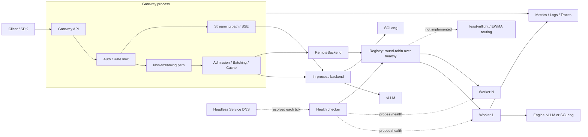

# V-Gate

[](https://github.com/Kare0638/V-Gate/actions/workflows/tests.yml)
[](https://www.apache.org/licenses/LICENSE-2.0)
[](https://www.python.org/downloads/)
[](https://www.docker.com/)

**V-Gate** is an LLM inference gateway being built toward distributed serving: a gateway tier that owns admission, batching, caching, and routing, in front of a pool of inference workers.

The gateway tier is implemented — an OpenAI-shaped Chat Completions subset with streaming, dynamic micro-batching, result caching, observability, security, benchmarking, and container/Kubernetes deployment artifacts. The [vLLM](https://github.com/vllm-project/vllm) path has been exercised against a live GPU; the [SGLang](https://github.com/sgl-project/sglang) path is currently a unit-tested non-streaming adapter and has not yet been validated against a live SGLang engine.

**Multi-worker serving runs, but has not been benchmarked.** Inference happens in separate `role: worker` processes; the gateway routes across them round-robin, probes their health in the background, removes failing workers from rotation, and lets them rejoin once they recover. A killed worker does not fail requests — traffic shifts to the survivors, and `503` with `Retry-After` is returned only when every worker is down. What is missing is the evidence: no 1-vs-N throughput or tail-latency measurement exists yet, and routing is round-robin only (least-inflight and EWMA are [Phase 4](ROADMAP.md#phase-4-multi-worker-serving)). Streaming through a worker returns 501. Multimodal requests are a separate planned milestone. Live-GPU validation has been performed on one NVIDIA GeForce RTX 3060 Laptop GPU with 6GB VRAM; no RTX 4060 or multi-GPU validation is claimed.

## Validated Evidence

The evidence below is a measured snapshot of the current serving path. The vLLM run predates parts of the current async path and is retained as a directional baseline pending a refreshed repeat-run report.

| Path | Evidence | Scope |
|------|----------|-------|
| **vLLM live GPU** | [`Qwen/Qwen2.5-1.5B-Instruct-AWQ`](benchmarks/results/vllm_baseline.md) via vLLM 0.26 on an RTX 3060 Laptop GPU: **294.09 generated tokens/s**, **6.47 requests/s**, **1.5264s p95 latency** | 40 requests at concurrency 8, from one small benchmark run; a directional baseline, not a capacity claim |
| **SGLang adapter** | Non-streaming adapter behavior is covered by [`tests/test_backends.py`](tests/test_backends.py) | Unit tests use stubs; no live-engine or live-GPU SGLang benchmark is claimed |

---

## Features

| Feature | Status | Description |
|---------|--------|-------------|
| **OpenAI-Shaped Chat API** | Partial | Chat Completions request/response subset (`/v1/chat/completions`); not claimed as full drop-in OpenAI compatibility |
| **Embeddings Endpoint** | Partial | `/v1/embeddings` currently returns a mock 1536-dimensional vector for API/client testing |
| **Streaming Inference** | Partial | SSE streaming for dry-run and real vLLM; SGLang streaming is not implemented yet |
| **Admission Control & Dedup** | Implemented | Bounds concurrent inferences and coalesces identical in-flight requests onto one; the gateway no longer builds batches — engines do that internally |
| **Engine-Native Scheduling** | Implemented | Batching is left to the engine's own continuous batching; the gateway does admission control and deduplication instead of building windows |
| **Result Caching** | Implemented | In-memory LRU cache with batch-level deduplication for non-streaming requests |
| **Backend Adapters** | Partial | Select vLLM or SGLang with `model.engine_type`; vLLM is live-GPU validated, while SGLang is currently unit-tested and non-streaming |
| **Built-in Benchmarking** | Implemented | Concurrent load tools, report generation, and `/v1/benchmark` |
| **Observability** | Implemented | Prometheus metrics, structured logs, and optional OpenTelemetry tracing |
| **Security** | Implemented | Bearer API keys and per-key sliding-window rate limits |
| **Configuration as Code** | Implemented | YAML configuration with environment-variable overrides |
| **Container Deployment** | Implemented | Docker CPU/GPU targets, Compose stack, and Kubernetes manifests deploying the gateway and workers as separate components |
| **Python Client SDK** | Implemented | Sync/async clients with deterministic streaming cleanup |
| **Gateway/Worker Split** | Partial | Inference runs in separate `role: worker` processes reached over HTTP; streaming through a worker returns 501 |
| **Worker Registry & Health** | Implemented | Membership from static config or headless-Service DNS discovery, with background `/health` probing, threshold-based removal, and automatic rejoin on recovery |
| **Latency-Aware Routing** | Partial | Round-robin across healthy workers; least-inflight and EWMA are not implemented |
| **Circuit Breaking & Recovery** | Partial | Failing workers leave rotation and rejoin after sustained health; connection failures retry on another worker |

---

## Architecture

Solid arrows are the current runtime; dashed arrows are not implemented yet. The gateway either holds a backend in-process (the single-process default) or forwards to a pool of worker processes whose membership it discovers. Both paths exist today, and the pool has been exercised on a live Kubernetes cluster scaling between one and three workers.



The boundary: the gateway owns admission control, deduplication, caching, and observability; a worker owns one engine instance and nothing else. Because `RemoteBackend` implements the same `InferenceBackend` protocol as the local engines, the batcher does not know whether inference is local or remote — adding the worker hop required no change to it.

That split is what makes 1-vs-N worker scaling, health-aware failover, and independent GPU-node placement measurable rather than hypothetical. Failover and scaling are now exercised on a live cluster; **throughput is still not measured**, and routing remains round-robin. The 1-vs-N benchmark is the next step.

---

## Documentation

- [Roadmap](ROADMAP.md): detailed roadmap — correctness, continuous batching, reliability, multi-worker routing, Kubernetes, and performance work, with per-phase acceptance criteria. Its `Phase 0-8` numbering is internal to that document; the [Roadmap](#roadmap) section below is the authoritative priority ordering.
- [Documentation conventions](docs/README.md): meaning of the Implemented / Partial / Planned status labels used across these docs.
- [Containerization test report](docs/reports/CONTAINERIZATION_TEST_REPORT.md): Docker validation notes.

---

## Quick Start

### Option 1: Docker (Recommended)

**Real GPU Mode**
```bash
# Build and run with GPU support
docker compose up vgate

# Or build manually
docker build --target vgate-gpu -t vgate:latest .
docker run --gpus all -p 8000:8000 --ipc=host vgate:latest
```

**CPU Mode (CI/Testing)**
```bash
# Run in dry-run mode (no GPU required)
docker compose --profile cpu up vgate-cpu

# Or build manually
docker build --target vgate-cpu -t vgate:cpu .
docker run -p 8000:8000 vgate:cpu
```

**Full Monitoring Stack**
```bash
# Start V-Gate + Prometheus + Grafana
docker compose --profile monitoring up

# Access:
# - V-Gate API:  http://localhost:8000
# - Prometheus:  http://localhost:9090
# - Grafana:     http://localhost:3000 (admin/admin)
```

### Option 2: Local Development

```bash
# Clone repository
git clone https://github.com/Kare0638/V-Gate.git
cd V-Gate

# Create virtual environment
python -m venv .venv
source .venv/bin/activate

# Install dependencies
pip install -r requirements.txt

# Run server
python main.py
```

### Option 2b: Gateway + Worker (Split Mode)

Run inference in a separate process. The gateway loads no model — it forwards
to the worker and keeps batching, caching, and admission control.

```bash
# Terminal 1 — worker (owns the engine)
VGATE_ROLE=worker VGATE_SERVER__PORT=8001 VGATE_DRY_RUN=true python main.py

# Terminal 2 — gateway (holds no model)
VGATE_ROLE=gateway VGATE_SERVER__PORT=8000 \
  VGATE_WORKER__ENDPOINTS='["http://127.0.0.1:8001"]' python main.py

# Requests go to the gateway as usual
curl -X POST http://localhost:8000/v1/chat/completions \
  -H "Content-Type: application/json" \
  -d '{"model":"test","messages":[{"role":"user","content":"hello"}],"max_tokens":16}'
```

Or with Compose:

```bash
docker compose --profile split up
```

Multiple workers, with failover:

```bash
# Two workers
VGATE_ROLE=worker VGATE_SERVER__PORT=8001 VGATE_DRY_RUN=true python main.py
VGATE_ROLE=worker VGATE_SERVER__PORT=8002 VGATE_DRY_RUN=true python main.py

# Gateway routing across both
VGATE_ROLE=gateway VGATE_SERVER__PORT=8000 \
  VGATE_WORKER__ENDPOINTS='["http://127.0.0.1:8001","http://127.0.0.1:8002"]' python main.py

# Per-worker health is visible on /stats
curl -s http://localhost:8000/stats | jq .workers
```

Behavior of split mode:

- **Round-robin across healthy workers.** Least-inflight and EWMA routing are not implemented.
- **Failover works without dropping requests.** Killing a worker removes it from rotation; traffic continues on the survivors. Only when *every* worker is down do requests get `503` with `Retry-After`.
- **Retries are limited to connection failures.** A worker that refuses a connection never received the request, so another worker takes it. A worker that times out may already be generating, so that is *not* retried — one client request must not cost two GPU generations.
- **Recovery is automatic.** A background probe polls `/health` independently of traffic, so a restarted worker rejoins even while the gateway is idle.
- **No streaming.** `stream: true` returns `501` before any SSE bytes are sent, instead of a `200` followed by an in-band error.
- The worker exposes only `/internal/generate`, `/health`, and `/metrics`; client-facing routes return `404` in the worker role.
- With `security.enabled`, set `worker.api_key` on the gateway — `/internal/generate` is not an exempt path, so it requires the same bearer token as any other route (health probes send it too).

### Option 2c: Kubernetes

The manifests deploy the same split: a gateway `Deployment` in front of a
worker `StatefulSet`.

**On a fresh cluster:**

```bash
# Build the tags the manifests reference. They are version-pinned rather than
# :latest — the manifests set imagePullPolicy: IfNotPresent, so a moving tag
# would let one node keep serving a months-old image while another serves
# today's, with nothing in the cluster reporting the difference.
docker build --target vgate-cpu -t vgate:0.3.2-cpu .
docker build --target vgate-gpu -t vgate:0.3.2-gpu .

# Render and apply the dry-run overlay
kustomize build k8s/overlays/cpu | kubectl apply -f -

# Real vLLM workers on GPU nodes; the gateway stays on the CPU image
kustomize build k8s/overlays/gpu | kubectl apply -f -
```

A digest (`vgate@sha256:…`) is the only genuinely immutable reference; the
version tag is a convention this repo keeps, not something the registry
enforces. `k8s/validate_manifests.py` fails the build if any image reverts to a
moving tag or leaves `imagePullPolicy` unset.

> #### Upgrading a cluster that ran the pre-split manifests
>
> **`kubectl apply` alone is not a safe upgrade path here.** It creates and
> updates but never deletes objects that were removed from the manifests, and
> the split renamed the workloads. Three objects are left behind:
> `Deployment/vgate`, `HorizontalPodAutoscaler/vgate`, and
> `PersistentVolumeClaim/vgate-model-cache`.
>
> The Deployment is the damaging one. Its pods carry
> `app.kubernetes.io/name=vgate` and `app.kubernetes.io/component=gateway` —
> exactly what the new `Service/vgate` selects — so the old monolith stays
> behind the public endpoint and keeps taking live traffic.
>
> Reproduced on kind ([full log](docs/reports/K8S_MIGRATION_VERIFICATION.md)):
> after a plain apply, `Service/vgate` listed three endpoints — two old
> monolith pods and one new gateway — and **24 of 40 requests came back
> `401`**, against 40 of 40 succeeding before the upgrade. The old pods still
> validate the API key from the ConfigMap they mounted at startup rather than
> the Secret the new manifests use, and a mounted ConfigMap key does not
> reload. So the practical result is not a subtle routing quirk but most of
> the client traffic failing outright. After migrating, all 40 requests
> reached the new gateway. On a GPU cluster the old Deployment also holds its
> `nvidia.com/gpu` until deleted, which can leave the new workers
> unschedulable.
>
> ```bash
> # Report what would be removed; changes nothing, exits non-zero if found
> ./k8s/migrate-from-monolith.sh --check
>
> # Remove the pre-split objects, then apply
> ./k8s/migrate-from-monolith.sh --overlay cpu
> ./k8s/migrate-from-monolith.sh --overlay gpu --delete-pvc
> ```
>
> The script deletes the old objects *before* applying the new ones, accepting
> a short gap with no gateway running. Applying first would avoid the gap but
> puts both topologies behind the same Service at once, and on GPU nodes would
> require enough GPUs for both.
>
> `kubectl apply --prune` is the built-in mechanism for this and is
> deliberately not used: it is still Alpha, carries a "do not use unless you
> are aware of what the current state is" warning in kubectl's own help, and
> prunes by label expression, so a bad match deletes live workloads. The orphan
> set here is small, known, and fixed, which makes naming the three objects
> both safer and easier to review.
>
> On a cluster that never ran the pre-split manifests the script reports
> nothing to migrate and applies normally, so it is safe to use unconditionally.

Why a `StatefulSet` for workers: the gateway's registry tracks each worker
separately, so it needs to address them individually. A `Deployment` gives its
pods random, changing names, so there is no stable address to put in a registry
— only the Service in front of them. A `StatefulSet` gives every pod an
ordinal-stable name and therefore a stable record
(`vgate-worker-0.vgate-worker.vgate.svc.cluster.local`). It also gives each
worker its own model-cache volume, so a `ReadWriteOnce` StorageClass supports
more than one replica; a single shared claim would force every worker onto one
node.

The Service in front of them is headless (`clusterIP: None`) to remove the
load-balanced virtual IP, leaving per-pod DNS as the only way to address the
pool. Worth stating precisely, because it is easy to overclaim: dropping
`clusterIP: None` does **not** by itself stop `vgate-worker-0.vgate-worker`
from resolving — a StatefulSet writes each pod's hostname into the
EndpointSlice and CoreDNS serves per-pod records from that either way. This was
measured, not assumed. Headless earns its place by suppressing the virtual IP,
not by creating records it is often credited with.

**Worker membership is discovered, not configured.** The gateway resolves the
headless Service on each health-check tick, so `kubectl scale
statefulset/vgate-worker` reaches it with no manifest change. The kind run
scales 1 → 3 → 2 and asserts the gateway follows each time.

Endpoints are keyed by the pod's **stable DNS name**, not its address. Forward
resolution yields IPs; a reverse lookup turns each back into
`vgate-worker-<n>.vgate-worker.…`, which survives a restart because a
StatefulSet reuses ordinals. Addresses do not — and since every
`vgate_worker_*` metric is labelled by endpoint, address identity would add a
new time series on every pod restart until the metrics endpoint buckles. Where
a cluster serves no PTR records, discovery falls back to the address and logs
that it did, because the cost is invisible until it is severe.

Three behaviours worth knowing:

- **An empty *answer* has to repeat before it is believed; a resolver *failure*
  never counts.** Those are different facts. `EAI_NONAME` is the resolver
  saying authoritatively that the name has no records, which is what a pool
  scaled to zero looks like — three consecutive such ticks (~15s) empty the
  registry, after which requests get `503` with `Retry-After`. `EAI_AGAIN` and
  friends mean the resolver could not answer at all and say nothing about the
  pool; treating those as empty let a CoreDNS blip lasting a few ticks make the
  gateway discard every healthy worker it had.
- **A discovered worker waits for a probe before taking traffic.** The worker
  Service publishes not-ready addresses deliberately, so a pod still loading
  model weights is in the DNS answer — its presence is evidence it exists, not
  evidence it is ready. Admitting it on sight sends real requests to a worker
  that may stall mid-request, and a stalled request is a `request_error`, which
  is deliberately not retried and so reaches the client as a `500`. A worker
  that has never been proven usable is admitted by a single successful probe;
  one that was *demoted* still needs sustained recovery, because it was proven
  bad once. Endpoints supplied in static config stay optimistic — they carry no
  readiness information either way, and the worst case is one request that a
  connection failure retries elsewhere.
- **Health state survives a re-resolve.** Membership refreshes every few
  seconds while demotion needs consecutive failures, so resetting counters on
  refresh would mean a broken worker never accumulates enough to leave
  rotation.
- **A full resolve-and-probe pass completes before startup does.** Resolving
  alone is not enough now that arrivals start out of rotation: startup would
  finish with a pool that is known but entirely unadmitted. The wait is
  bounded, so an unreachable resolver or worker delays the first request rather
  than the process.

Resolution uses `AF_UNSPEC` rather than `AF_INET`, so an IPv6-only cluster —
which publishes AAAA records and no A records — resolves normally; IPv6
literals are bracketed when discovery falls back to addresses.

`worker.endpoints` still works and is what a docker-compose or bare-process
deployment uses; setting `worker.discovery.dns_name` switches to discovery.
`k8s/validate_manifests.py` fails the build if the configured DNS name does not
name the worker Service, or if both are set at once.

Autoscaling covers the gateway only. CPU utilization is a false signal for a
GPU worker — the GPU saturates while the CPU waits on it — so a CPU-triggered
rule would never fire on an overloaded worker. Worker autoscaling needs queue
depth and in-flight counts exported through the custom metrics API, plus DNS
discovery so a new replica receives traffic at all.

**Verified on a live cluster.** [`docs/reports/K8S_SPLIT_VERIFICATION.md`](docs/reports/K8S_SPLIT_VERIFICATION.md)
is the log of a real run, reproducible with:

```bash
./k8s/kind-verify.sh          # add --keep to leave the cluster up
```

It builds the CPU image, creates a 3-node [kind](https://kind.sigs.k8s.io/)
cluster, deploys the overlay, serves a request end to end, then removes a
worker **while traffic is still flowing** and reports the status codes seen
across the removal — the window before the health checker reacts is the part
worth measuring, and asking once afterwards would only show the steady state.

In the checked-in run the two workers were scheduled on different nodes, each
bound its own PVC, per-pod DNS resolved to distinct addresses, and requests
split 5/4 across the pool.

Across the removal, that run served **61 of 62 requests with `200`** and one
with `500`. **The window is not zero-loss, and that is by design.** The retry
policy splits on what the departed worker could already have started:

| Failure | Meaning | Action |
|---|---|---|
| `connect_error` | never delivered | retried on another worker |
| `request_error` | already in flight when the pod died | **not** retried |

Retrying the second class would let one client request cost two GPU
generations. The run's metrics show exactly one `request_error` against the
removed worker, which accounts for the single `500` — so the assertion the
script makes is not "no request failed" but "every non-200 is an un-retryable
mid-flight failure". Other runs came out 77/77 and 81/81 with no failure at
all; whether the window catches a request in flight is timing. Closing it needs
draining, listed as a gap in [ROADMAP.md](ROADMAP.md).

One gap the run exposed: the gateway passes its readiness probe while holding
zero healthy workers, because `/health` never consults the registry. See
[ROADMAP.md](ROADMAP.md).

Both live scripts **assert** rather than print. Every claim they make is a
`[PASS]`/`[FAIL]` line and the script exits non-zero on any failure, so a wrong
topology cannot produce a passing report. Verified by breaking the manifests on
purpose: with the worker count reduced to one, six assertions failed and the
run exited 1.

**Manifests are checked in CI** (`.github/workflows/manifests.yml`) at two
levels: `kubeconform` for schema validity, and `k8s/validate_manifests.py` for
architecture invariants — the gateway requests no GPU and mounts no model
cache, the worker Service is headless, the public Service cannot select worker
pods, the endpoint list matches the replica count, images are pinned with an
explicit pull policy, and both overlays agree on the fields Kubernetes refuses
to update in place. The second layer exists because these manifests once
described a single-process service for months after the split landed, while
passing schema validation the whole time. Each check is verified to fail
against a deliberately broken manifest, not only to pass against the current
one.

### Option 3: Isolated SGLang Environment (Recommended)

Use a dedicated virtual environment for `sglang[all]` to avoid dependency conflicts with your existing `vllm` environment.

```bash
cd V-Gate

# Create isolated env for SGLang
uv venv .venv-sglang --python 3.12

# Install base project deps
uv pip install --python .venv-sglang/bin/python -r requirements.txt

# Install SGLang full stack
uv pip install --python .venv-sglang/bin/python "sglang[all]==0.5.9"

# Optional: install test tools in this env
uv pip install --python .venv-sglang/bin/python pytest pytest-asyncio
```

---

## API Usage

### Health Check
```bash
curl http://localhost:8000/health
# {"status":"ok","version":"0.3.2"}
```

### Chat Completions
```bash
curl -X POST http://localhost:8000/v1/chat/completions \
  -H "Content-Type: application/json" \
  -H "Authorization: Bearer sk-vgate-xxxxx" \
  -d '{
    "model": "Qwen/Qwen2.5-1.5B-Instruct-AWQ",
    "messages": [{"role": "user", "content": "What is 2+2?"}],
    "max_tokens": 100
  }'
```

### Streaming Chat Completions

```bash
curl -N -X POST http://localhost:8000/v1/chat/completions \
  -H "Content-Type: application/json" \
  -d '{
    "model": "Qwen/Qwen2.5-1.5B-Instruct-AWQ",
    "messages": [{"role": "user", "content": "What is 2+2?"}],
    "max_tokens": 100,
    "stream": true
  }'
```

Returns OpenAI-style SSE delta chunks. Works for the dry-run backend and real vLLM (`AsyncLLMEngine`, verified on GPU); SGLang still raises a clear error until its async engine streaming path lands (see [ROADMAP.md](ROADMAP.md) Phase 2). The streaming path also bypasses the batcher/cache for now (no dedup or admission control yet).

Streaming has its own `/metrics` series, separate from the batcher's non-streaming TTFT/TPOT since the two are measured differently (engine-reported vs. gateway-side wall clock): `vgate_stream_ttft_seconds`, `vgate_stream_tpot_seconds` (token-weighted — a single SSE delta can carry more than one token), `vgate_stream_duration_seconds`, `vgate_stream_tokens_total`, and `vgate_stream_requests_total{status="completed"|"error"|"cancelled"}`.

### Prometheus Metrics
```bash
curl http://localhost:8000/metrics
```

### Statistics
```bash
curl http://localhost:8000/stats
```

### Inline Benchmark API
```bash
curl -X POST http://localhost:8000/v1/benchmark \
  -H "Content-Type: application/json" \
  -d '{
    "prompts": ["Explain KV cache in one paragraph."],
    "max_tokens": 128,
    "rounds": 3
  }'
```

### Python Client SDK

```bash
pip install ./vgate-client
```

```python
from vgate_client import VGate

# Synchronous client
client = VGate(base_url="http://localhost:8000", api_key="sk-vgate-dev-example")

response = client.chat.create(
    model="Qwen/Qwen2.5-1.5B-Instruct-AWQ",
    messages=[{"role": "user", "content": "What is 2+2?"}],
    max_tokens=100,
)
print(response.choices[0].message.content)

# Embeddings
embedding = client.embeddings.create(model="mock-embedding-model", input="Hello world")

# Health check
health = client.health()

client.close()
```

```python
from vgate_client import AsyncVGate

# Asynchronous client
async with AsyncVGate(base_url="http://localhost:8000", api_key="sk-...") as client:
    response = await client.chat.create(
        model="Qwen/Qwen2.5-1.5B-Instruct-AWQ",
        messages=[{"role": "user", "content": "Hello!"}],
    )
```

Streaming is available on both clients as `chat.stream(...)`, yielding OpenAI-style `ChatCompletionChunk` objects (`chunk.choices[0].delta.content`):

```python
from vgate_client import VGate

client = VGate(base_url="http://localhost:8000")
for chunk in client.chat.stream(
    model="Qwen/Qwen2.5-1.5B-Instruct-AWQ",
    messages=[{"role": "user", "content": "What is 2+2?"}],
    max_tokens=100,
):
    if chunk.choices[0].delta.content:
        print(chunk.choices[0].delta.content, end="", flush=True)
client.close()
```

```python
from vgate_client import AsyncVGate

async with AsyncVGate(base_url="http://localhost:8000") as client:
    async for chunk in client.chat.stream(
        model="Qwen/Qwen2.5-1.5B-Instruct-AWQ",
        messages=[{"role": "user", "content": "What is 2+2?"}],
        max_tokens=100,
    ):
        if chunk.choices[0].delta.content:
            print(chunk.choices[0].delta.content, end="", flush=True)
```

A failure mid-stream (a `data: {"error": ...}` event from the server, or a dropped connection) raises immediately — `chat.stream()` never retries once tokens have already been yielded, since a retry would duplicate text the caller already received. This includes the connection ending without a `data: [DONE]` event: that's treated as a broken stream (`ServerError`), not a clean completion. `chat.stream(...)` also works as a context manager (`with client.chat.stream(...) as stream:` / `async with ...`) so stopping iteration early — e.g. `break` — still closes the underlying connection deterministically instead of leaving it open until GC.

---

## Benchmark

### Compare Backends (CLI)

```bash
# Compare vLLM and SGLang in dry-run mode
PYTHONPATH=. VGATE_DRY_RUN=true python benchmarks/bench_compare.py --backends vllm sglang

# Run vLLM only, custom rounds/tokens
PYTHONPATH=. python benchmarks/bench_compare.py --backends vllm --rounds 5 --max-tokens 256

# JSON output for automation
PYTHONPATH=. python benchmarks/bench_compare.py --backends vllm sglang --output json
```

### Benchmark Current Server Backend

`POST /v1/benchmark` runs benchmark through the full server pipeline (batcher + cache + backend) using the active `model.engine_type`. It reports latency (mean/p50/p95), TTFT/TPOT (mean/p50/p95), batching stats (batches formed, average batch size, deduplication), and cache hit rate for the run.

### Concurrent Load Benchmark

`benchmarks/bench_load.py` drives real concurrent HTTP traffic at a *running* server's `/v1/chat/completions`, then diffs `/stats` before/after to attribute batching and cache behavior to the run:

```bash
# Start a server first, e.g.: VGATE_DRY_RUN=true python main.py
PYTHONPATH=. python benchmarks/bench_load.py --concurrency 8 --requests 80
PYTHONPATH=. python benchmarks/bench_load.py --prompt-file prompts.txt --output json
PYTHONPATH=. python benchmarks/bench_load.py --stream --concurrency 8 --requests 40
```

With `--stream`, each request is sent with `stream: true` and consumed as SSE; the report adds client-observed TTFT percentiles. The streaming path bypasses `RequestBatcher` (see above), so an all-streaming run's batching/cache stats will correctly show no activity — that reflects the current architecture, not a bug in the benchmark. Its `tokens/sec` is server-reported: the benchmark diffs the server's own `vgate_stream_tokens_total` counter (via `/metrics`) before and after the run, rather than counting SSE content-delta events client-side — a single delta can carry more than one real token, so client-side chunk counting would undercount. The raw content-delta count is still shown separately as a diagnostic, clearly labeled as not a token count.

`benchmarks/run_report.py` orchestrates a full report: it spawns a fresh server subprocess per scenario (dry-run baseline, a batch-size sweep, and a cache/dedup-impact comparison) and writes the results to [`benchmarks/results/baseline.md`](benchmarks/results/baseline.md):

```bash
PYTHONPATH=. python benchmarks/run_report.py --requests 60 --concurrency 8
```

[`benchmarks/results/baseline.md`](benchmarks/results/baseline.md) is a **dry-run baseline** (no GPU) — the mock backend uses a synthetic per-call delay (`VGATE_DRYRUN_SIMULATED_LATENCY_MS`) so batching has something real to amortize, but it does not measure actual model throughput.

[`benchmarks/results/vllm_baseline.md`](benchmarks/results/vllm_baseline.md) is a **real GPU baseline**: `Qwen/Qwen2.5-1.5B-Instruct-AWQ` on an RTX 3060 Laptop GPU (6GB VRAM) via vLLM 0.26. Producing it surfaced three integration gaps that are now fixed: vLLM disabled pinned memory by default under WSL2 even on a kernel that supported it; `VLLMBackend` read metrics fields that had been renamed upstream while an `LLM()` default disabled stats collection, causing silent zero TTFT/TPOT values; and `RequestBatcher` treated `max_batch_size` only as a trigger and drained the entire queue. The checked-in report preserves the original run and its sample-size caveats; the batching cap described there is a historical gap, not the current behavior.

---

## Configuration

V-Gate uses a layered configuration system with the following priority:

**Environment Variables > YAML Config > Defaults**

### Configuration File (`config.yaml`)

```yaml
version: "0.3.2"

server:
  host: "0.0.0.0"
  port: 8000

model:
  model_id: "Qwen/Qwen2.5-1.5B-Instruct-AWQ"
  quantization: "awq"
  gpu_memory_utilization: 0.7
  max_model_len: 2048
  trust_remote_code: true
  enforce_eager: true
  engine_type: "vllm"  # "vllm" or "sglang"

batch:
  max_batch_size: 8       # max concurrent inferences (see note below)
  max_wait_time_ms: 50.0  # deprecated, ignored

cache:
  enabled: true
  maxsize: 1000

logging:
  level: "INFO"
  json_format: true

security:
  enabled: false
  api_keys:
    - key: "sk-vgate-prod-xxxxx"
      name: "production"
      rate_limit: 100
  rate_limiting:
    enabled: true
    default_limit: 60
    window_seconds: 60
  exempt_paths:
    - "/health"
    - "/metrics"

benchmark:
  warmup_rounds: 1
  test_rounds: 3
  max_tokens: 128
  prompts:
    - "Explain the concept of machine learning in one paragraph."
    - "Write a Python function that computes the Fibonacci sequence."
    - "What are the benefits of using a load balancer?"
```

### Backend Selection

```bash
# Default backend: vllm
VGATE_MODEL__ENGINE_TYPE=vllm python main.py

# Switch to SGLang backend
VGATE_MODEL__ENGINE_TYPE=sglang python main.py
```

### A note on `batch.max_batch_size`

Its meaning changed, and an existing config file will keep loading while behaving differently — so it is worth stating plainly.

**Before**: the gateway collected requests into a window (`max_batch_size` requests, or `max_wait_time_ms` elapsed) and handed the whole window to one backend call.

**Now**: the gateway does not build batches. Each request calls the backend on its own, and `max_batch_size` bounds how many may do so at once.

Two reasons for the change:

1. **vLLM and SGLang already batch, and do it better.** They can admit a new request into a batch that is already decoding; a sealed Python-side window cannot. The gateway-side window was competing with the engine's own scheduler rather than helping it.
2. **A sealed batch is routed as a unit.** Every request in it lands on the same worker regardless of that worker's load, which makes load-aware routing impossible. Routing needs one decision per request.

What survived from the old batcher, because it was never really about batching:

- **Deduplication**, now stronger — identical concurrent requests coalesce onto one inference for as long as it is in flight, not merely if they landed in the same window.
- **Admission control**, which is what `max_batch_size` now expresses.

`max_wait_time_ms` is accepted and ignored; there is no window to wait for. The startup log reports the value it is ignoring.

Concurrency is capped by what the backend declares. `VLLMBackend` and `RemoteBackend` allow concurrent calls — `AsyncLLMEngine` exists to serve them, and serializing it would leave the GPU decoding one sequence at a time with continuous batching switched off. `SGLangBackend` does not declare it, because that adapter has never been run against a live engine, so its calls stay serialized until that is measured rather than assumed.

### What happens to a request whose caller gave up

A `timeout` on the client side, or a disconnect, does not automatically kill the inference — other callers may be coalesced onto the same one. The rule depends on whether the work has been admitted:

| State | On last caller leaving | Why |
|---|---|---|
| Queued, not yet admitted | **Cancelled** | Nothing has been spent, and it would otherwise hold an admission permit a live request could use |
| Already running | **Runs to completion** | The backend call is in a thread and cannot be interrupted anyway; its result populates the cache, so finishing is cheaper than discarding it |

Reclamation counts waiters rather than firing on the first departure, so one caller timing out never cancels work another is still waiting for. Cancellations are counted in `vgate_abandoned_inferences_total`.

### Environment Variables

| Variable | Description | Default |
|----------|-------------|---------|
| `VGATE_CONFIG_PATH` | Path to config file | `./config.yaml` |
| `VGATE_DRY_RUN` | Enable dry-run mode (no GPU) | `false` |
| `VGATE_SERVER__PORT` | Server port | `8000` |
| `VGATE_MODEL__ENGINE_TYPE` | Inference backend (`vllm`/`sglang`) | `vllm` |
| `VGATE_MODEL__MODEL_ID` | Model identifier | `Qwen/Qwen2.5-1.5B-Instruct-AWQ` |
| `VGATE_BATCH__MAX_BATCH_SIZE` | Max batch size | `8` |
| `VGATE_CACHE__MAXSIZE` | Cache size limit | `1000` |
| `VGATE_LOGGING__LEVEL` | Log level | `INFO` |
| `VGATE_LOGGING__JSON_FORMAT` | JSON log format | `true` |
| `VGATE_SECURITY__ENABLED` | Enable security | `false` |

---

## Docker Images

| Image | Base | Use Case |
|-------|------|----------|
| `vgate:latest` | `vllm/vllm-openai:latest` | Real GPU inference |
| `vgate:cpu` | `python:3.12-slim` | CI/CD, testing, dry-run |

The current GPU Dockerfile follows the upstream `latest` tag, while the checked-in GPU baseline used vLLM 0.26. A rebuild is therefore not guaranteed to reproduce that historical report; benchmarked release images must pin an exact tag or digest and record it in the generated report.

### Build Commands

```bash
# GPU image
docker build --target vgate-gpu -t vgate:latest .

# CPU image
docker build --target vgate-cpu -t vgate:cpu .
```

---

## Monitoring

### Prometheus Metrics

| Metric | Type | Description |
|--------|------|-------------|
| `vgate_requests_total` | Counter | Total requests by endpoint, method, status |
| `vgate_request_latency_seconds` | Histogram | Request latency distribution |
| `vgate_batch_size` | Histogram | Batch size distribution |
| `vgate_batch_processing_seconds` | Histogram | Batch processing time |
| `vgate_ttft_seconds` | Histogram | Time to first token |
| `vgate_tpot_seconds` | Histogram | Time per output token |
| `vgate_tokens_generated_total` | Counter | Total tokens generated |
| `vgate_cache_hits_total` | Counter | Cache hits |
| `vgate_cache_misses_total` | Counter | Cache misses |

### Grafana Setup

After starting the monitoring stack, configure Grafana to visualize V-Gate metrics:
1. Navigate to http://localhost:3000
2. Login with `admin/admin`
3. Add Prometheus data source: `http://prometheus:9090`
4. Create dashboards using `vgate_*` metrics

---

## Security

### API Key Authentication

```bash
# Request with API key
curl -H "Authorization: Bearer sk-vgate-prod-xxxxx" \
     http://localhost:8000/v1/chat/completions \
     -d '{"model": "qwen", "messages": [{"role": "user", "content": "Hello"}]}'
```

### Rate Limit Headers

| Header | Description |
|--------|-------------|
| `X-RateLimit-Limit` | Maximum requests allowed |
| `X-RateLimit-Remaining` | Remaining requests in window |
| `X-RateLimit-Reset` | Unix timestamp when window resets |
| `Retry-After` | Seconds to wait (on 429 response) |

---

## Project Structure

```
V-Gate/
├── main.py                     # FastAPI application entry point
├── demo.py                     # Minimal end-to-end usage demo
├── config.yaml                 # Default configuration
├── Dockerfile                  # Multi-stage Docker build (GPU/CPU targets)
├── docker-compose.yml          # Service orchestration
├── requirements.txt            # Python dependencies
├── ROADMAP.md                  # Detailed serving-track roadmap
├── DEVLOG.md                   # Development log
├── .github/workflows/
│   └── tests.yml               # CI: dry-run server suite + client SDK suite
├── vgate/
│   ├── __init__.py
│   ├── engine.py               # Backend factory + engine wrapper
│   ├── batcher.py              # Request batching, dedup, and queue metrics
│   ├── cache.py                # LRU result cache
│   ├── config.py               # Configuration management
│   ├── logging_config.py       # Structured logging
│   ├── metrics.py              # Prometheus metrics
│   ├── security.py             # Authentication & rate limiting
│   ├── tracing.py              # OpenTelemetry tracing setup
│   └── backends/
│       ├── base.py             # Inference backend protocol + dry-run backend
│       ├── vllm_backend.py     # vLLM adapter (AsyncLLMEngine)
│       └── sglang_backend.py   # SGLang adapter (non-streaming)
├── vgate-client/               # Python Client SDK
│   ├── pyproject.toml
│   ├── vgate_client/
│   │   ├── __init__.py
│   │   ├── client.py           # Sync & async clients (incl. streaming)
│   │   ├── models.py           # Request/response models
│   │   └── exceptions.py       # Error classes
│   └── tests/
├── benchmarks/
│   ├── benchmark.py            # Single-engine benchmark entry
│   ├── bench_compare.py        # Multi-backend benchmark comparison CLI
│   ├── bench_load.py           # Concurrent HTTP load generator (+ --stream)
│   ├── run_report.py           # Multi-scenario report orchestrator
│   ├── _run_scenario_cli.py    # Per-scenario subprocess driver
│   ├── _aggregate_results.py   # Result aggregation helpers
│   └── results/
│       ├── baseline.md         # Dry-run baseline report
│       └── vllm_baseline.md    # Real GPU (RTX 3060) baseline report
├── k8s/
│   ├── base/                   # gateway Deployment + Service + HPA,
│   │                           #   worker StatefulSet + headless Service,
│   │                           #   namespace, configmap, secret, servicemonitor
│   ├── overlays/
│   │   ├── cpu/                # dry-run workers, no GPU (used by kind)
│   │   └── gpu/                # vLLM workers on GPU nodes
│   ├── kind-cluster.yaml       # 3-node local cluster definition
│   ├── kind-verify.sh          # Deploy on kind and prove failover works
│   ├── migrate-from-monolith.sh # Remove pre-split orphans, then apply
│   ├── verify-migration.sh     # Reproduce the upgrade hazard and the fix
│   └── validate_manifests.py   # Architecture invariants, checked in CI
├── monitoring/
│   └── prometheus.yml          # Prometheus configuration
├── scripts/
│   └── test_concurrent.py      # Ad-hoc concurrency smoke script
├── docs/
│   ├── README.md               # Documentation index
│   ├── design/                 # Architecture and roadmap proposals
│   └── reports/                # Validation and test reports
└── tests/
    ├── conftest.py             # Shared fixtures + OTel/SGLang stubs
    ├── test_backends.py
    ├── test_batcher.py
    ├── test_batching.py
    ├── test_bench_load.py
    ├── test_benchmark.py
    ├── test_cache.py
    ├── test_cache_log.py
    ├── test_chat_completions.py
    ├── test_config.py
    ├── test_observability.py
    ├── test_security.py
    ├── test_streaming.py
    └── test_tracing.py
```

---

## Development

### Running Tests

```bash
# Install test dependencies (httpx2 is required by FastAPI's TestClient;
# httpx is used directly by some tests for ASGI-transport requests)
pip install pytest pytest-asyncio httpx httpx2

# Run all tests
PYTHONPATH=. VGATE_DRY_RUN=true pytest tests/ -v

# Run specific test file
pytest tests/test_batcher.py -v

# Validate vLLM backend path
VGATE_DRY_RUN=true pytest tests/test_backends.py -k vllm -v

# Validate SGLang backend path (in .venv-sglang)
VGATE_DRY_RUN=true ./.venv-sglang/bin/pytest tests/test_backends.py -k sglang -v
```

CI ([`.github/workflows/tests.yml`](.github/workflows/tests.yml)) runs the same dry-run suite plus the client SDK tests (`vgate-client/tests/`) on every push/PR to `main`.

### Code Style

```bash
# Format code
black .

# Lint
ruff check .
```

---

## Roadmap

### Current Serving Baseline

- [x] OpenAI-shaped Chat Completions subset and backend abstraction
- [x] vLLM `AsyncLLMEngine` integration and real SSE streaming
- [x] Unit-tested SGLang non-streaming backend adapter (live-engine validation pending)
- [x] Dynamic micro-batching, request deduplication, and RAM result cache
- [x] Prometheus metrics, structured logging, and OpenTelemetry integration
- [x] Concurrent load tools and checked-in dry-run/real-GPU benchmark reports
- [x] Docker, split-topology Kubernetes manifests with CI validation, and sync/async Python SDK

The priority order below is authoritative. [ROADMAP.md](ROADMAP.md) holds the detailed acceptance criteria; its internal `Phase` numbering is a different axis and does not imply execution order relative to these priorities.

### Next Up

The Priority sections below group work by area. This is the execution order, with
what each step unblocks or answers, so the sequence can be argued with rather
than guessed at.

**1. DNS-based worker discovery.** — **done.** The gateway resolves the
headless Service on each health-check tick, so `kubectl scale` reaches it and
the worker count is now a variable the steps below can vary.

**2. Measure 1 worker vs N.** The central claim of the architecture — that a
pool serves better than a single process — has never been measured. Throughput,
p50/p95/p99, and behaviour under injected worker failure, at N = 1, 2, 4. This
is also the harness step 4 needs.

**3. Backpressure: bounded queues, request deadlines, stable overload
responses.** Priority 1 below has stayed unstarted while Priorities 2 and 3
advanced, which is worth stating plainly rather than quietly reordering. It
moves after measurement because load data is what shows where the queue
actually builds; adding limits first would be picking numbers with nothing to
check them against.

**4. Load-aware routing, measured against round-robin.** Least-inflight and
EWMA are unblocked but not implemented. They are also unfalsifiable without
step 2: under uniform load, round-robin and least-inflight are
indistinguishable, so the deliverable is the comparison under heterogeneous
load, not the code.

**5. Prefix-cache-aware routing.** The first item on this list that is specific
to LLM serving rather than general request routing: sending requests that share
a prompt prefix to the same worker lets that worker reuse its KV cache, and
round-robin actively destroys that locality. Needs step 4's routing seam.

**6. Multi-GPU validation.** All live-GPU evidence comes from one 6GB laptop
GPU running a 1.5B model, so tensor parallelism, KV-cache pressure, and
multi-GPU scheduling are entirely untested. Renting two A100s for a single
run would replace an assumption with a measurement.

### Priority 1: Backpressure And Reliability

Originally framed as a prerequisite — a single node should fail predictably
before N nodes do. That ordering was not followed: the split, the routing
rewrite, and the Kubernetes work all landed first, so this section describes
work that is now overdue rather than upcoming.

- [ ] Unify streaming and non-streaming admission control
- [ ] Add bounded queues, deadlines, and stable overload responses
- [ ] Abort backend work on client cancellation instead of computing orphaned tokens
- [ ] Add request timeouts and per-backend error classification
- [ ] Make gateway readiness reflect whether it can serve — `/health` returns `ok` without consulting the worker registry, so Kubernetes routes traffic to a gateway holding zero healthy workers and those requests get `503`
- [ ] Drain in-flight work on worker shutdown — the gateway addresses pods directly, so removing a pod from a Service's endpoints does not stop traffic to it; a terminating worker must fail its own `/health` while still finishing what it has

### Priority 2: Distributed Inference Serving

- [x] Split the gateway from inference workers behind an internal HTTP API
- [x] Add a worker registry with background health checks and failure isolation
- [x] Add gateway-to-worker bearer authentication for a private cluster
- [~] Add routing strategies — round-robin is implemented; least-inflight and EWMA latency are not
- [~] Add worker circuit breakers, draining, and recovery on rejoin — failing workers leave rotation and rejoin after sustained health; there is no in-flight draining
- [x] Redefine `RequestBatcher` as dedup/admission/fan-out so routing decisions are per request rather than per batch
- [x] Replace the static endpoint list with headless-Service DNS discovery, so worker membership follows the cluster
- [ ] Measure 1-worker vs N-worker throughput, tail latency, and behavior under injected worker failure
- [ ] Route on prompt-prefix affinity so a worker can reuse its KV cache across related requests

`[~]` marks partial items. Least-inflight and EWMA are unblocked — `RequestBatcher` now fans out, so each request is routed on its own and a load-aware policy can act on the signal it reads. What is missing is not the seam but the evidence: under uniform load these policies are indistinguishable from round-robin, so implementing one without the 1-vs-N harness would produce a change nobody can show is an improvement.

### Priority 3: Heterogeneous Kubernetes Deployment

- [x] Deploy the gateway and inference workers as separate components
- [x] Add GPU node placement and independent CPU/GPU worker scaling
- [x] Validate manifests in CI for schema and for architecture invariants
- [~] Scale on pending resource demand and queue/inflight signals instead of CPU utilization alone — the gateway autoscales on CPU, which suits it; the worker has no autoscaler, because CPU is a false signal for a GPU process and the queue-depth signals that would work are not exported through the custom metrics API. Worker autoscaling is no longer blocked on discovery — a new replica is picked up within one health-check tick — so what remains is exporting the queue-depth signals through the custom metrics API.
- [ ] Add worker-down, overload, and tail-latency alerts plus an operational runbook

### Optional Follow-ups

- [ ] Evaluate vLLM-Omni as an isolated backend for heterogeneous image/audio/video outputs
- [ ] Add model/operator version management and canary rollout only after the core execution path is stable
- [ ] Pursue C++/CUDA optimization only when profiling identifies a measured bottleneck

See [ROADMAP.md](ROADMAP.md) for the detailed serving milestones and acceptance criteria. Planned items above describe intended work and must not be read as current functionality.

---

## Compliance & Legal Disclaimer

1. **License**: This project is licensed under the Apache License 2.0.
2. **Model Terms**: V-Gate is an inference server. Users must separately adhere to the license terms of the underlying models (e.g., Qwen, LLaMA).
3. **Content Responsibility**: The author of V-Gate is NOT responsible for any content generated using this software. Users are fully responsible for the outputs and must ensure compliance with local safety laws and ethical guidelines.
4. **No Warranty**: This software is provided "as is". Live-GPU validation is currently limited to an RTX 3060 Laptop GPU with 6GB VRAM; other hardware has not been validated.

See the [LICENSE](LICENSE) file for full license text.

---

## Contributing

Contributions are welcome! Please feel free to submit a Pull Request.

1. Fork the repository
2. Create your feature branch (`git checkout -b feat/amazing-feature`)
3. Commit your changes (`git commit -m 'feat: add amazing feature'`)
4. Push to the branch (`git push origin feat/amazing-feature`)
5. Open a Pull Request
